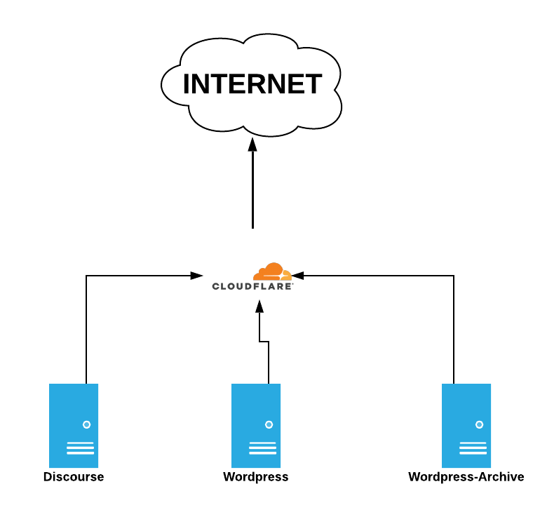

# sfcu-digital ocean deployment 
This is a repo is a collection of yaml files to deploy the SFCU stack using digital ocean for everything. I'm hoping this helps anyone trying to understand what we have done. 

##Current setup

